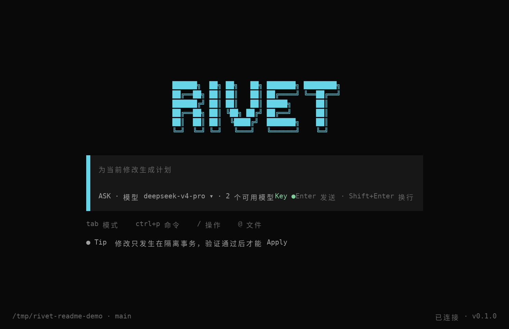
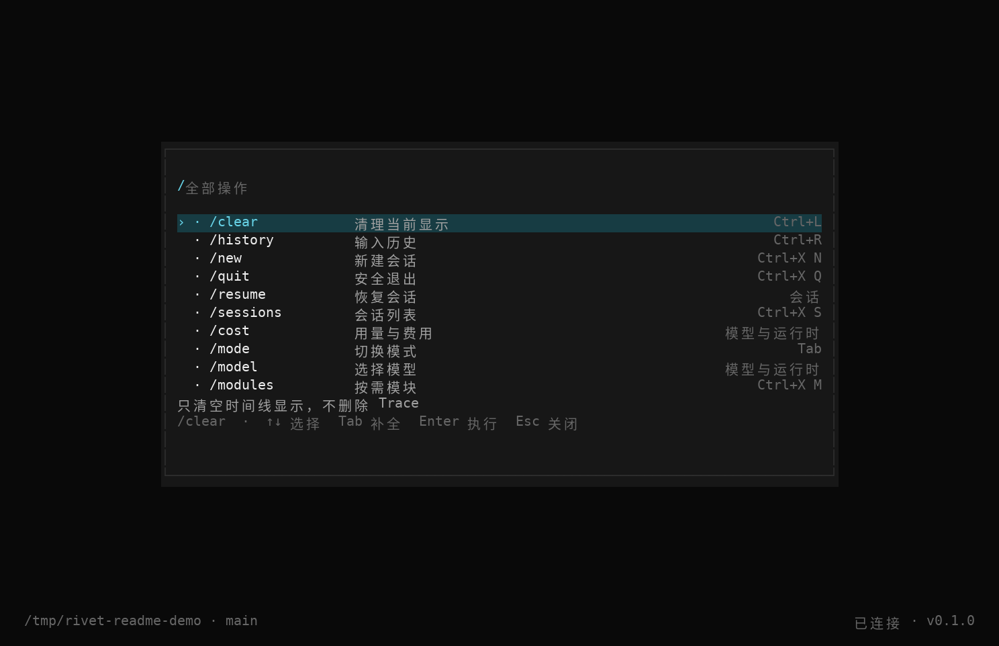
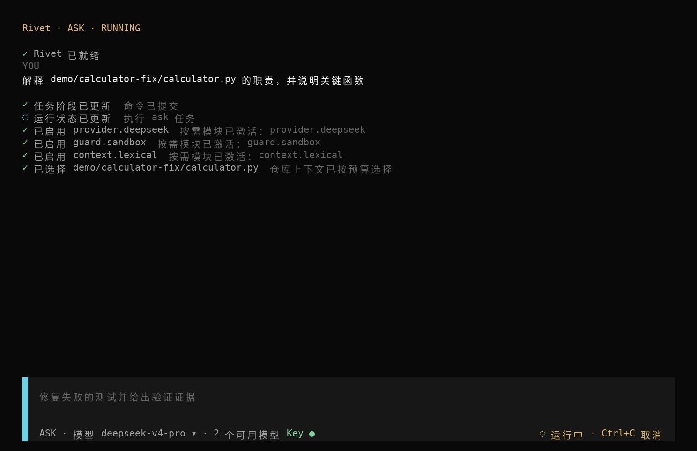
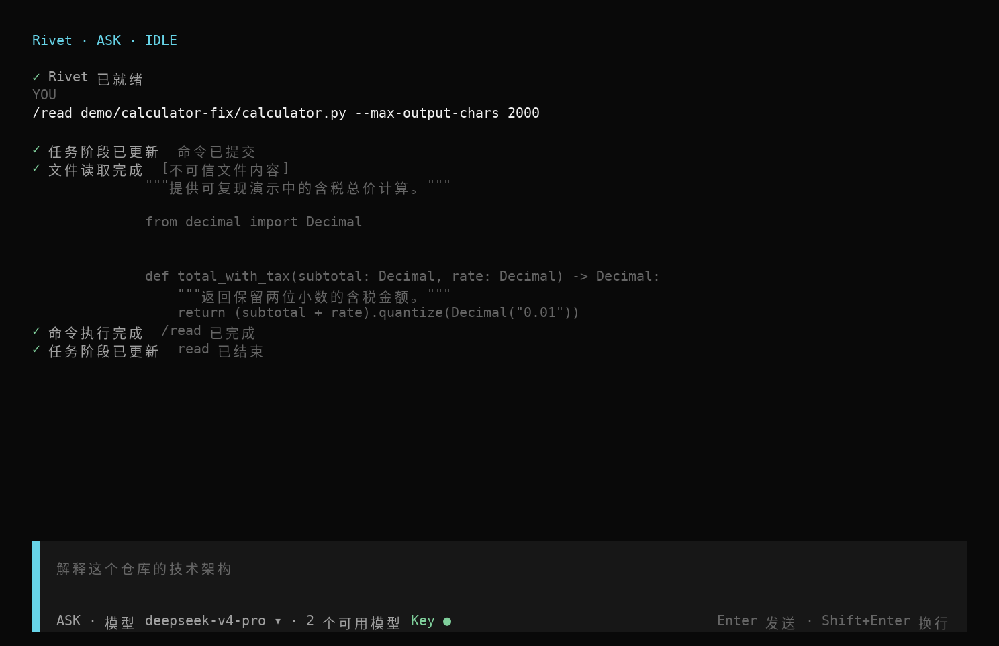

<div align="center">

# RIVET

**A lightweight, modular coding agent for your terminal.**

基于自研 Agent Kernel 与按需模块的本地编程智能体。

<a href="pyproject.toml"></a>
<a href=".github/workflows/ci.yml"></a>
<a href="LICENSE"></a>

</div>

<p align="center">
  
</p>

## Rivet 是什么

Rivet 是运行在本地终端中的编程智能体。它通过自行实现的 Rivet Kernel 驱动模型与本地工具，并按任务动态激活所需模块，在轻量运行的同时完成仓库理解、隔离修改和结果验证。

## 核心设计

### Rivet Kernel

自行实现 Agent Loop、工具调用、上下文编排、预算、取消、Trace、错误恢复与 ResourceScope 生命周期；核心执行循环不依赖现成 Agent 框架。

### Rivet Modules

Context、Reader、Transaction、Verify、Evidence、Guard 和 LSP 等能力以 On-demand Modules 组织。Kernel 只在任务需要时激活模块，并在 Lease 释放或任务结束后回收相应资源。

## 运行界面

输入 `/` 查看可用操作、快捷键、参数提示和当前状态。

<p align="center">
  
</p>

任务运行时，时间线展示按需激活的模块、上下文选择和工具执行状态。

<p align="center">
  
</p>

Reader 的真实结果会标记不可信文件内容，并保留命令与完成状态。

<p align="center">
  
</p>

## Quick Start

当前仓库为 Private，克隆前需要相应的 GitHub 访问权限。Ubuntu 24.04 上从源码启动：

```bash
git clone https://github.com/cypre5s/rivet_cli.git
cd rivet_cli
uv sync --all-extras --dev --frozen
bun install --cwd tui --frozen-lockfile

export DEEPSEEK_API_KEY="your-api-key"
uv run rivet
```

不启动 TUI 时可直接提问：

```bash
uv run rivet ask "解释当前仓库的结构"
```

一次隔离修改工作流如下；将 `<transaction_id>` 替换为 `fix` 输出的事务 ID：

```bash
uv run rivet plan "修复 demo/calculator-fix 中失败的测试"
uv run rivet fix --yes \
  --allow-write demo/calculator-fix/calculator.py \
  "修复 demo/calculator-fix 中失败的测试"
uv run rivet verify
uv run rivet diff
uv run rivet apply <transaction_id>
```

## Commands & Requirements

| 命令 | 作用 |
| --- | --- |
| `rivet ask` | 只读理解和回答 |
| `rivet plan` | 生成可验证计划 |
| `rivet fix` | 在隔离事务中修改代码 |
| `rivet verify` | 验证当前事务 |
| `rivet diff` | 查看事务补丁 |
| `rivet apply` | 应用通过验证的事务 |
| `rivet read` | 安全读取项目文件 |
| `rivet modules` | 查看和管理按需模块 |

在 TUI 中输入 `/` 可以查看全部可用操作。

**基础运行依赖：** Ubuntu 24.04、Python 3.13、uv、Git、ripgrep 与 bubblewrap。OpenTUI 还需要 Bun 1.4.x 和已安装的 `tui` 依赖；Headless 命令不需要 Bun。

**可选增强依赖：** Tesseract 与 Poppler 用于 OCR，ffprobe 用于补充媒体元数据；音视频转录还需要 `transcription` 可选依赖和已下载的本地 faster-whisper 模型。缺少增强依赖时 Reader 会返回明确的降级状态，不会虚构正文。

Rivet 使用 [MIT License](LICENSE)。
