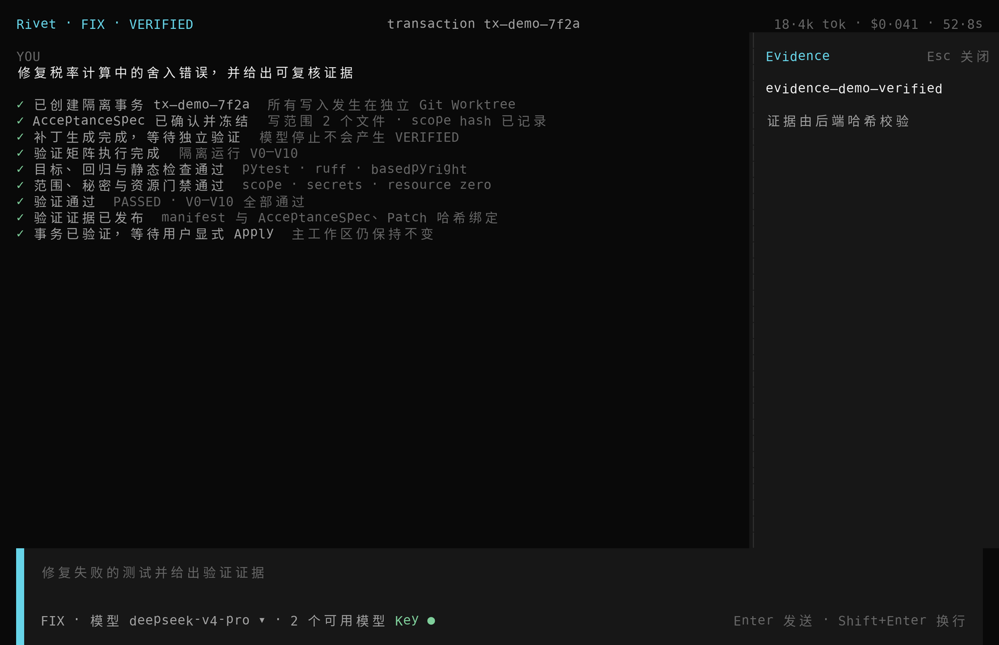

<div align="center">

# RIVET

**A lightweight coding agent that verifies before it applies.**

轻量且可靠的本地编程智能体：按需运行，验证后应用。

<a href="pyproject.toml"></a>
<a href="tui/package.json"></a>
<a href=".github/workflows/ci.yml"></a>
<a href="#1-lightweight-by-design"></a>
<a href="#2-reliable-by-evidence"></a>
<a href="LICENSE"></a>

<p>
  <a href="#核心设计">核心设计</a> ·
  <a href="#运行界面">运行界面</a> ·
  <a href="#快速开始">快速开始</a> ·
  <a href="#命令与运行要求">命令与运行要求</a>
</p>

</div>

<p align="center">
  
</p>

## Rivet 是什么

Rivet 是一个轻量且可靠的本地编程智能体：通过 Agent Kernel 与按需模块控制运行成本，通过隔离事务与证据驱动验证保障代码修改可信。

## 核心设计

Rivet 只有两个并列的核心目标：让 Agent 在能力增长时仍保持轻量，以及让它交付的代码修改可以被独立复核。Agent Kernel 与 On-demand Modules 共同实现第一个目标，并不是两个彼此分离的产品方向。

[Aider](https://github.com/Aider-AI/aider) 强调终端结对编程、仓库地图与 Git 集成，[OpenCode](https://github.com/anomalyco/opencode) 提供终端编程智能体，[OpenHands](https://github.com/OpenHands/OpenHands) 面向多后端的自托管开发平台，[goose](https://github.com/aaif-goose/goose) 则覆盖多种 Provider 与扩展。Rivet 选择了不同的核心约束：不以集成数量作为主要差异，而是让运行成本随本次实际启用的能力增长，并让补丁在独立证据通过前无法进入主工作区。

### 1. Lightweight by Design

`Rivet Kernel + On-demand Modules` 的目的不是减少功能，而是避免为尚未使用的功能预付启动时间、内存、进程和依赖成本。

- **设计目的：** 启动时只保留轻量而确定的控制面，让一次简单问答无需同时启动代码索引、LSP、OCR、转录、Git Worktree 和完整验证链；任务变复杂时再逐项获得能力，使常驻成本不必随功能总量同步膨胀。
- **设计依据：** [Anthropic 的 Agent 工程实践](https://www.anthropic.com/research/building-effective-agents)建议从满足需求的最简单方案开始，并指出更高自主性会带来额外延迟、成本和累积错误风险；[VS Code Activation Events](https://code.visualstudio.com/api/references/activation-events)也证明了按命令、语言或视图惰性激活大型能力的可行性。因此，轻量化应来自清晰的激活边界，而不是删掉必要能力或安全约束。
- **解决的问题：** 传统 Coding Agent 容易随着 Reader、LSP、沙箱、事务和验证功能增加，把更多导入、后台进程、连接与生命周期耦合放进每次启动路径。结果是简单任务也承担完整工具链成本，可选依赖缺失会阻塞无关任务，异常退出后还可能留下进程、客户端、临时目录或 Worktree。
- **实现方式：** 自研 `Rivet Kernel` 只负责 AgentLoop、工具协议、显式状态、预算、取消、Checkpoint、Trace 与资源所有权；Context、Reader、LSP、Transaction、Verify、Evidence、Guard 等以内置 `ON_DEMAND` 模块提供。启动阶段只解析 Manifest，不导入 capability factory、不实例化模块，也不启动其进程或连接；任务请求某项 capability 时，`ModuleRuntime` 才按依赖图激活最小闭包。`Lease` 保证使用中的模块不会休眠，释放后遵循模块空闲策略；手动休眠或任务关闭时按逆激活顺序清理 `ResourceScope`，并以资源归零检查结束生命周期。

<p align="center">
  
  <br />
  <sub>ASK 任务只激活当前需要的 Provider、Guard 与 lexical Context，未使用能力不进入运行路径。</sub>
</p>

### 2. Reliable by Evidence

可靠修补的判断依据不是模型说“已经完成”，而是隔离环境中能够重放、校验并绑定到当前补丁的本地证据。

- **设计目的：** 在自动修改前固定目标与边界，在修改期间保护主工作区，在修改后用独立验证决定能否交付。模型负责理解、规划和生成候选补丁，但没有权限把自己的文本结论升级成 `VERIFIED`。
- **设计依据：** [NIST AI 600-1](https://www.nist.gov/publications/artificial-intelligence-risk-management-framework-generative-artificial-intelligence)将自信但错误的生成内容与人类的自动化偏见列为生成式 AI 风险，并强调部署前测试、验证及评估记录；[MCP 工具安全规范](https://modelcontextprotocol.io/specification/2025-06-18/server/tools)要求校验输入与结果、实施访问控制，并让用户能够确认敏感操作。代码修改具有真实副作用，因此“生成补丁”和“证明补丁可交付”必须由不同边界完成。
- **解决的问题：** 避免 Agent 因上下文不足找错代码、直接污染主工作区、越过任务范围修改相邻文件，或把模型自述和一次有限测试通过误当成完整修复；同时避免验证结果无法追溯到确切的 AcceptanceSpec、补丁字节和执行记录，导致用户无法判断 Apply 是否安全。
- **实现方式：** Context 按 `L0 仓库清单 → L1 词法检索 → 必要时 L2 Tree-sitter → 精确语义需要时 L3 LSP` 逐级取证；写入前显式确认并冻结带哈希的 `AcceptanceSpec`，将读范围、写范围、允许新建路径和禁止路径分离。所有自动修改发生在独立 [Git Worktree](https://git-scm.com/docs/git-worktree)，主工作区在 Apply 前保持不变；模型停止时，`fix` 最多进入 `READY_FOR_VERIFICATION`。随后 `Rivet Verify` 独立执行 V0–V10，覆盖基线、目标与回归测试、静态检查、范围、秘密和资源门禁，并把结论、命令、Diff、changed symbols 与逐文件哈希写入原子发布的 `Evidence Bundle`。只有 Evidence 与 AcceptanceSpec、Patch 三重绑定且状态为 `VERIFIED` 的事务，才能由用户显式执行 `rivet apply`。

<p align="center">
  
  <br />
  <sub>模型只生成候选补丁；独立验证与哈希 Evidence 通过后，事务才进入 VERIFIED 并等待显式 Apply。</sub>
</p>

## 运行界面

输入 `/` 查看可用操作、快捷键、参数提示和当前状态。

<p align="center">
  
</p>

Reader 的真实结果会标记不可信文件内容，并保留命令与完成状态。

<p align="center">
  
</p>

## 快速开始

当前仓库为 Private，克隆前需要相应的 GitHub 访问权限。Ubuntu 24.04 上从源码启动：

```bash
git clone https://github.com/cypre5s/rivet_cli.git
cd rivet_cli
uv sync --all-extras --dev --frozen
bun install --cwd tui --frozen-lockfile

export DEEPSEEK_API_KEY="your-api-key"
uv run rivet
```

不启动 TUI 时可直接提问：

```bash
uv run rivet ask "解释当前仓库的结构"
```

一次隔离修改工作流如下；将 `<transaction_id>` 替换为 `fix` 输出的事务 ID：

```bash
uv run rivet plan "修复 demo/calculator-fix 中失败的测试"
uv run rivet fix --yes \
  --allow-write demo/calculator-fix/calculator.py \
  "修复 demo/calculator-fix 中失败的测试"
uv run rivet verify
uv run rivet diff
uv run rivet apply <transaction_id>
```

## 命令与运行要求

| 命令 | 作用 |
| --- | --- |
| `rivet ask` | 只读理解和回答 |
| `rivet plan` | 生成可验证计划 |
| `rivet fix` | 在隔离事务中修改代码 |
| `rivet verify` | 验证当前事务 |
| `rivet diff` | 查看事务补丁 |
| `rivet apply` | 应用通过验证的事务 |
| `rivet read` | 安全读取项目文件 |
| `rivet modules` | 查看和管理按需模块 |

在 TUI 中输入 `/` 可以查看全部可用操作。

**基础运行依赖：** Ubuntu 24.04、Python 3.13、uv、Git、ripgrep 与 bubblewrap。OpenTUI 还需要 Bun 1.4.x 和已安装的 `tui` 依赖；Headless 命令不需要 Bun。

**可选增强依赖：** Tesseract 与 Poppler 用于 OCR，ffprobe 用于补充媒体元数据；音视频转录还需要 `transcription` 可选依赖和已下载的本地 faster-whisper 模型。缺少增强依赖时 Reader 会返回明确的降级状态，不会虚构正文。

Rivet 使用 [MIT License](LICENSE)。
